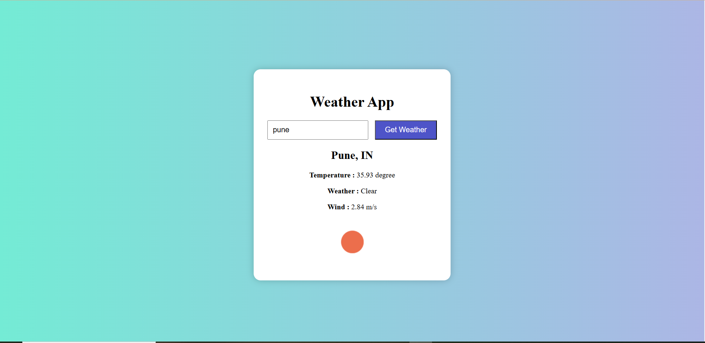

# Weather App 🌦️

A simple weather application that shows real-time weather using an API.

## Features
- Search by city name
- Shows temperature, humidity, and weather conditions
- Built using HTML, CSS, JavaScript

## Screenshots

## How to Use
1. Clone the repo
2. Open `index.html` in your browser
3. Enter city name and see weather data

## API Used
[OpenWeatherMap](https://openweathermap.org/api)

## Author
[@SanketMotewar](https://github.com/SanketMotewar)
